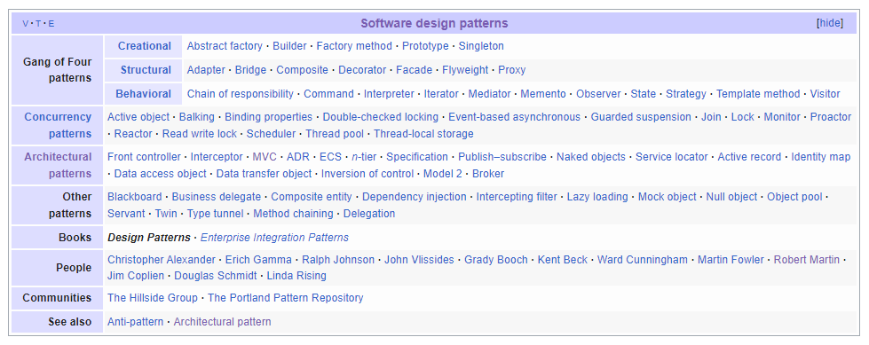

# 1주차 - 디자인 패턴의 종류와 특징
## 디자인 패턴이란
개발에서 발생하는 반복적인 문제들을 해결하기 위한 해결 방법이다.
디자인 패턴은 객체 지향의 4대 특성인 **캡슐화**, **상속**, **추상화**, **다형성**과 설계원칙 (SOLI)를 기반으로 구성되어있다.


Design Pattern의 분류

## 모바일 앱 대표 아키텍처 패턴
디자인 패턴 중 아키팩터 패턴은 공통적으로 자주 발생하는 문제를 해결하기 위한 재사용 가능한 해결 방법이다.
다른 말로 설계 패턴이라고도한다.
모바일 앱 개발에서 주로 사용하는 아키텍처는 4가지이다.

### 모바일 아키텍처의 종류
- MVC : Model-View-Controller
- MVP : Model-View-Presenter
- MVVM : Model-View-ViewModel
- MVI : Model-View-Intent

### 공통 구성 요소
위에 모바일 패턴들은 공통적으로 두 가지 구성 요소(Component)를 가지고 있다.
```
1. View
  Model의 정보를 기반으로 색상, 모양, 클릭 이벤트 수신 등 화면과 레이아웃을 처리한다.
2. Model
  View가 Model의 데이터를 렌더링하고 작동하는 비지니스 로직을 관리한다. 데이터의 수정, 갱신에 필요한 API 혹은 query를 제공한다.
```

## MVC
```
Model-View-Controller
```
### 구조
- Model : 어플리케이션에 사용되는 데이터와 데이터 처리
- View : 사용자에게 보여지는 UI
- Controller : 사용자의 입력(Action)을 받고 처리

### 동작
1. 사용자의 입력(Action)을 Controller가 확인한다.
2. Controller는 Action을 확인 후 Model을 업데이트한다.
3. Controller은 Model을 나타낼 View를 선택한다.
4. View는 Model을 활용하여 UI를 업데이트한다.

### 특징
MVC는 Model, View, Controller로 구성된 패턴이다.
비지니스 로직과 UI를 분리하는 **관심사 분리**가 중점으로, 이후 나오는 아키텍처에 큰 영향을 끼쳤다.
MVC 모델은 Controller가 여러개의 View를 선택할 수 있는 1:n 구조를 가진다.
Controller은 View를 선택만 할 수 있으며 직접 업데이트를 하지는 않고, 선택된 View는 Controller를 알지 못한다.

MVC 패턴은 가장 단순하여 보편적으로 사용된다.
그러나, View와 Model의 의존성이 높아 어플리케이션이 커질 수록 유지보수가 힘들다.

## MVP
```
Model-View-Presenter
```
### 구조
- Model : 어플리케이션에 사용되는 데이터와 데이터 처리
- View : 사용자에게 보여지는 UI
- Presenter : View에서 요청한 정보로 Model을 가공하여 View에게 전달

### 동작
1. 사용자의 입력(Action)을 View가 확인한다.
2. View는 데이터를 Presenter에게 요청한다.
3. Presenter는 Model에게 데이터를 요청한다.
4. Model은 Presenter에게 요청받은 데이터를 응답한다.
5. Presenter은 View에게 데이터를 응답한다.
6. View는 Presenter가 응답한 데이터를 활용하여 UI를 업데이트한다.

### 특징
Presenter은 사용자의 입력을 받은 View로 부터 호출받고, Model에게 비지니스 로직을 수행 및 데이터를 수신받으면 다시 View에게 전달하여 UI를 업데이트한다.
Presenter은 View와 Model의 인스턴스를 가지고 둘을 연결하며, Presenter과 View는 1:1의 관계를 가진다.

MVP 모델은 MVC와 달리 View와 Model의 의존성이 존재하지 않으나, View와 Presenter 사이의 의존성이 높아진다.
MVC와 비슷하게 어플리케이션이 커질 수록 의존성이 강해진다.

## MVVM
```
Model-View-ViewModel
```
### 구조
- Model : 어플리케이션에 사용되는 데이터와 데이터 처리
- View : 사용자에게 보여지는 UI
- View Model : View를 표현 및 View를 위한 데이터를 처리하는 Model

### 동작
1. 사용자의 입력(Action)을 View가 확인한다.
2. View는 받은 Action을 Command 패턴으로 View Model에게 전달한다.
3. View Model은 Model에게 데이터를 요청한다.
4. Model은 View Model에게 요청받은 데이터를 응답한다.
5. View Model은 응답 받은 데이터를 가공하여 저장한다.
6. View는 View Model과 Data Binding으로 UI를 업데이트한다.

### 특징
MVVM 패턴은 Command 패턴과 Data Binding, 두 가지 패턴을 사용하여 구성되어, View와 View Model 사이의 의존성이 없다.
View Model과 View는 1:1의 관계를 가진다.

각 부분이 독립적이기에 모듈화 하여 개발을 진행이 가능하나, View Model를 구성하기가 까다롭다.
상태 관리와 부수 효과(Side Effect)가 문제가 될 수 있다.
이는, 데이터를 개별적으로 관리하여, 복잡하게 묶여있는 함수들 간의 관계에서 문제가 발생 할 수 있다.

## MVI
```
Model-View-Intent
```
### 구조
- Model : 어플리케이션에 사용되는 데이터와 데이터 처리, Intent를 관찰
- View : 사용자에게 보여지는 UI, Model을 관찰
- Intent : 사용자 혹은 어플리케이션의 상태 변화를 위한 요청 및 이벤트 전달
  **Android의 Intent와는 다른 개념이다.**

### 동작
1. 사용자의 입력(Action)을 Intent가 확인한다.
2. Intent는 Model에서 처리하는 동작(Intended Action)을 제공한다.
3. Intent는 Model에게 데이터를 전달한다.
4. Model은 View에 표시할 새로운 모델을 생성한다.
5. View는 Model로 받은 새로운 모델로 UI를 업데이트한다.

### 특징
Android는 여러 이슈들로 인하여 코드가 복잡해지기 쉽다.
MVI 패턴은 단방향 (Uni-directional) 데이터 흐름과 불변성 (Immutability)로 예측 가능한 상태가 만들어져 유지보수가 용이하다.
각 부분의 의존성이 없다.

허나, RxJava와 같은 Observable한 외부 라이브러리를 사용해야한다.

## 참고 문서
- https://daryeou.tistory.com/310#google_vignette
- https://beomy.tistory.com/43
- https://magi82.github.io/android-mvc-mvp-mvvm/
- https://brunch.co.kr/@oemilk/113
- https://ittrue.tistory.com/550
- https://www.geeksforgeeks.org/mvc-model-view-controller-architecture-pattern-in-android-with-example/?ref=lbp
- https://blog.naver.com/jukrang/221597910488
- https://en.wikipedia.org/wiki/Design_Patterns