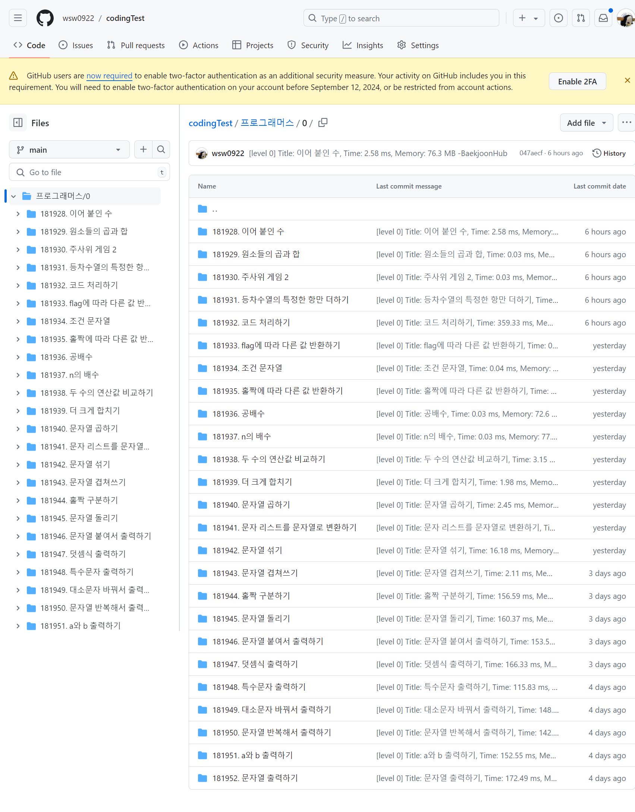
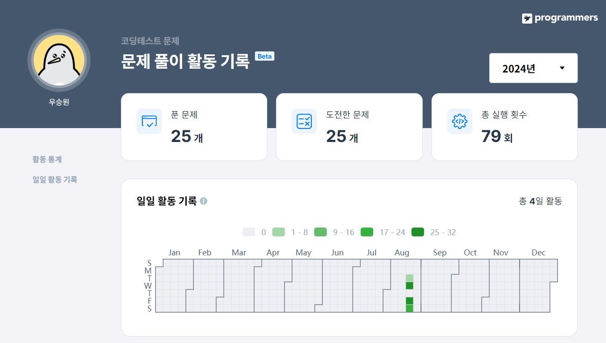
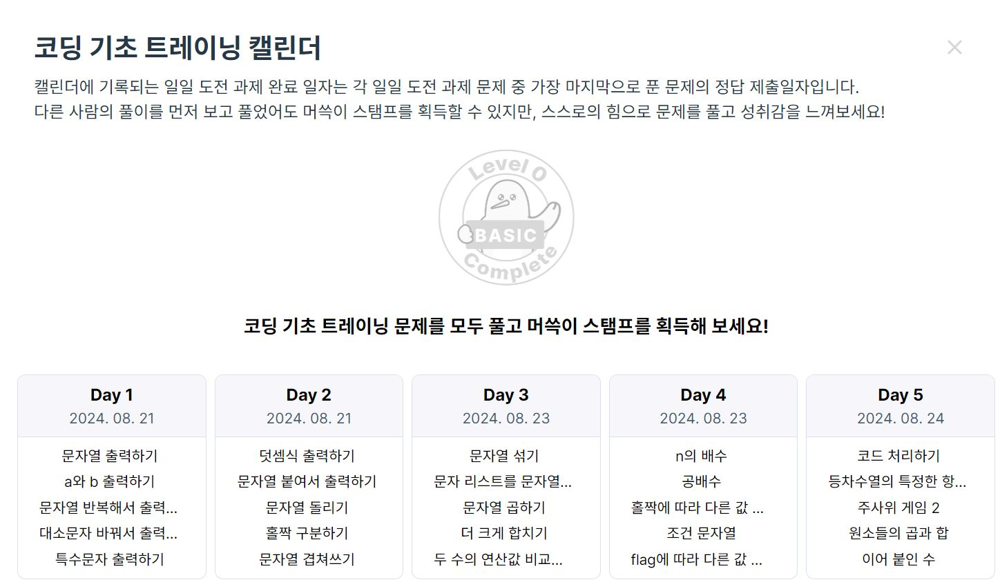

# 코딩테스트(프로그래머스 기초 문제)
## 가장 어려웠던 문제

#### 문제 이름 : 조건 문자열

#### 문제
> 문자열 code가 주어집니다.
code를 앞에서부터 읽으면서 만약 문자가 "1"이면 mode를 바꿉니다. mode에 따라 code를 읽어가면서 문자열 ret을 만들어냅니다.   
mode는 0과 1이 있으며, idx를 0 부터 code의 길이 - 1 까지 1씩 키워나가면서 code[idx]의 값에 따라 다음과 같이 행동합니다.   
mode가 0일 때 code[idx]가 "1"이 아니면 idx가 짝수일 때만 ret의 맨 뒤에 code[idx]를 추가합니다.
code[idx]가 "1"이면 mode를 0에서 1로 바꿉니다.   
mode가 1일 때 code[idx]가 "1"이 아니면 idx가 홀수일 때만 ret의 맨 뒤에 code[idx]를 추가합니다.
code[idx]가 "1"이면 mode를 1에서 0으로 바꿉니다.   
문자열 code를 통해 만들어진 문자열 ret를 return 하는 solution 함수를 완성해 주세요.   
단, 시작할 때 mode는 0이며, return 하려는 ret가 만약 빈 문자열이라면 대신 "EMPTY"를 return 합니다.

#### 본인 코드
```
class Solution {
    public String solution(String code) {
        String answer = "";
        int mode = 0;
        String ret = "";
        
        for (int i = 0; i < code.length(); i++) {
            if (code.charAt(i) == '1') {
                mode = 1 - mode;
            } else if (mode == 0 && i % 2 == 0) {
                ret += code.charAt(i);
            } else if (mode== 1 && i % 2 == 1) {
                ret += code.charAt(i);
            }
        }
        if(ret.equals("")) {
            ret = "EMPTY";
        }
        System.out.println(ret);
        answer = ret;
        
        return answer;
    }
}
```

#### 문제 도출 과정
1. 변수 선언 후 초기화 : mode(int), ret(String)
2. 반복문 설정 : idx를 0 ~ code 길이 -1까지 1씩 키워나감.
3. 조건문 설정   
a.  mode : code[i]가 "1"이면 mode를 바꿈(0 or 1)   
b. mode가 0이며 code[i]가 짝수 : ret += code[i]   
c. mode가 1이며 code[i]가 홀수 : ret += code[i]   
d. ret이 빈 문자열 : "EMPTY" return

#### 소감
해당 문제를 가장 어려웠던 문제로 선정한 이유는 많은 시도를 했다는 점에 있습니다. 조건을 한 번에 이해하지 못해 정답이 나올 때까지 여러 번 푸는 과정이 있었습니다.    
해당 문제의 다른 풀이를 보면 다음과 같습니다.
```
class Solution {
    public String solution(String code) {
        StringBuilder answer = new StringBuilder();
        int mode = 0;
        for (int i = 0; i < code.length(); i++) {
            char current = code.charAt(i);
            if (current == '1') {
                mode = mode == 0 ? 1 : 0;
                continue;
            }

            if (i % 2 == mode) {
                answer.append(current);
            }
        }
        return answer.length() == 0 ? "EMPTY" : answer.toString();
    }
}
``` 
StringBuilder, 삼항연산자, 다양한 메소드를 사용해 더 직관적이고 단순하게 문제를 풀이한 것을 보고 다른 풀이도 열심히 공부해야겠다는 생각이 들었습니다.
> StringBuilder : 문자열을 효율적으로 다루기 위해 사용되는 클래스. 내부적으로 가변적인 문자 배열을 사용하여, 문자열의 변경을 빠르게 수행함.

## 코테 풀이 인증
> 깃허브 연동 목록 캡쳐


> 프로그래머스 기록 캡쳐   


> 프로그래머스 코딩 기초 트레이닝 캘린더 캡쳐   

