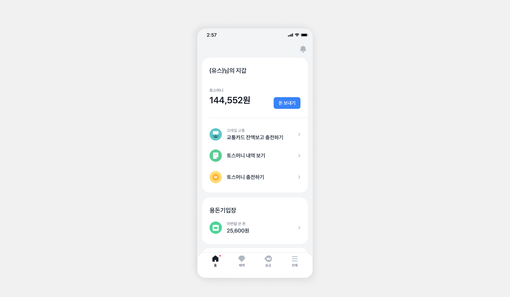
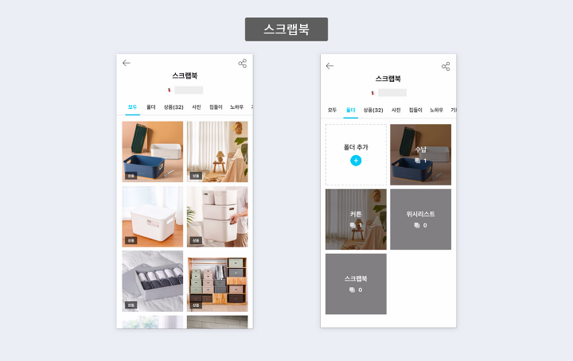

# ✅ 참여 방법
1. `이름` 으로 레포지토리를 생성한다. ex) `myeongji`
2. 레포지토리 생성 시 `ComposeTemplate` 을 템플릿으로 사용한다.
3. 매주 `branch` 생성 후 `Pull Request`를 한다. ex) `week1` / `week3`
4. PR을 보고 자유롭게 코드리뷰를 한다.
5. 내용 정리한 파일은 `/homework` 폴더에 정리해서 올린다.

# 섹션 1 - 컴포즈 컴포넌트 익히기

## 1주차

- Text, Button, [Modifier](https://developer.android.com/jetpack/compose/modifiers?hl=ko)
- Surface, Box, Row, Column
- BoxWithConstraints

## 2주차

- Image, Icon, Checkbox, TextField, Spacer, Divider
- Slot Api, Scaffold

## 3주차

- LazyColumn
- Dialog, SnackBar

# 섹션 2 - 컴포즈 개념 익히기 + 컴포넌트 활용

## 4주차

- [Compose 이해](https://developer.android.com/jetpack/compose/mental-model?hl=ko)
- [상태 관리](https://developer.android.com/jetpack/compose/state?hl=ko)
- 과제 - 아래 사진 컴포즈로 구현해보기   
  

## 5주차

- [수명 주기](https://developer.android.com/jetpack/compose/lifecycle?hl=ko)
- [부수 효과](https://developer.android.com/jetpack/compose/side-effects?hl=ko)
- 과제 - 아래 사진 horizontalpager를 활용하여 구현해보기   
  

## 6주차

- [단계](https://developer.android.com/jetpack/compose/phases?hl=ko)
- [성능](https://developer.android.com/jetpack/compose/performance?hl=ko)
- 과제 - LazyColumn 활용   
  

## 7주차

- [CompositionLocal](https://developer.android.com/jetpack/compose/compositionlocal?hl=ko)
- [컴포즈 안티 패턴 1-5](https://velog.io/@mraz3068/Jetpack-Compose-Top-20-mistakes-1-5)
- [컴포즈 안티 패턴 6-10](https://velog.io/@mraz3068/Jetpack-Compose-Top-20-mistakes-6-10)
- [컴포즈 안티 패턴 11-15](https://velog.io/@mraz3068/Jetpack-Compose-Top-20-mistakes-11-15)
- [컴포즈 안태 패턴 16-20](https://velog.io/@mraz3068/Jetpack-Compose-Top-20-mistakes-16-20)
- [Compose Stability설명](https://medium.com/@wind.orca.pe/compose-stability%EC%84%A4%EB%AA%85-8a071b4eda83)
- [Immutable collection vs Persistent collection](https://github.com/Kotlin/kotlinx.collections.immutable)