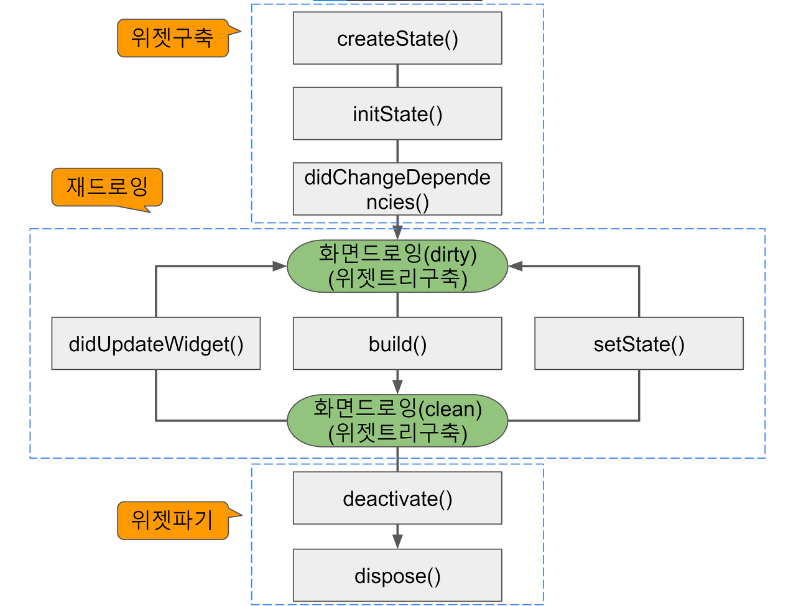

# Flutter Stateful 위젯의 생명 주기

## 생명 주기
1. **초기화 & 정리** : 애플리케이션 또는 컴포넌트의 초기화 및 정리 작업을 수행할 수 있다. **초기화 단계**에서는 데이터 로드, 리소스 할당을 담당하고, **정리 단계**에는 사용한 리소스를 해제하거나 연결을 닫는 역할을 한다.   
2. **상태 감지 & 업데이트** : 메소드를 통해 상태의 변화를 감지하고 이에 따라 적절한 업데이트 작업을 수행한다. 이는 UI의 동적 변경과 상태에 따른 동작을 유연하게 수행하도록 한다.   
3. **외부 리소스 관리** : 외부 리소스와의 상호작용을 관리한다. 
4. **오류 처리 & 예외 상황 대응** : 오류 로깅, 경고 메세지, 예외 처리 등을 메소드 내에서 처리 가능하다.
5. **성능 최적화** : 필요한 경우에만 리소스를 로드하거나 업데이트를 수행하도록 할 수 있다.

## Flutter의 생명 주기

>  출처 : https://fronquarry.tistory.com/16

#### 위젯 구축
1. `createState()` : State 객체를 생성하는 메소드. statefulWidget이 처음으로 생성될 때 호출된다.
2. `initState()` : State 객체가 생성된 후 최초로 호출되는 메소드. 데이터를 가져오거나 초기 상태를 설정하는 등의 작업을 수행할 수 있다.
3. `didChangeDependencies()` : 의존성이 변경된 경우 호출한다. State 객체가 의존하는 다른 객체나 데이터가 변경되었을 때 호출되는 메소드이다.  

#### 재 드로잉 
1. `build()` : 위젯을 빌드하는 메소드. 위젯을 구성하고 레이아웃을 정의하는 역할을 한다. 여러 번 호출 가능하다.
2. `didUpdateWidget()` : 위젯이 업데이트 되었을 때 호출한다. 업데이트 이전과 이후를 비교하여 변경사항을 처리할 수 있다.
3. `setState()` : 상태가 업데이트 되었을 때 호출되는 메소드. 상태를 업데이트하고 다시 렌더링할 필요가 있는 경우 사용된다.

#### 위젯 파기
1. `deactivate()` : 위젯이 트리에서 제거되기 전에 호출한다. 메모리 누수를 방지하기 위해 리소스 해제 또는 정리 작업을 수행할 수 있다.
2. `dispose()` : 위젯이 영구적으로 제거될 때 호출한다. 리소스 해제 또는 정리 작업을 수행할 수 있다. 

## 오류 해결
```

@override
void didChangeDependencies() {
    super.didChangeDependencies();
    ancestorContext = context; 
}

@override
void dispose() {
    nicknameController.dispose();
    super.dispose();
}

```
1. `didChangeDependencies()` : 트리에서 종속성에 변화가 생겼을 때 호출. `ancestorContext = context` 를 사용해 현재 위젯의 context를 조상 컨텍스트로 저장하는 역할을 한다.
2. `dispose()` : 해당 위젯이 트리에서 제거될 때 호출. TextEditingController를 해제하는 것에 사용한다.   

>  TextEditingController를 사용함에 있어 dispose() 오류가 발생해 해당 override를 추가하였다. 하지만 계속해서 dispose() 오류가 발생했다... 한참을 헤메다 발견한 것은 다른 파일에서 상태관리가 필요한 변수를 전역으로 선언한 것이었다. 생명주기에 따라 위젯이 트리에서 제거되었을 때 해제해야 하는 리소스들이 전역으로 선언되어 있어서 생긴 문제였었다. 생명 주기를 항상 신경쓰며 작업하자...