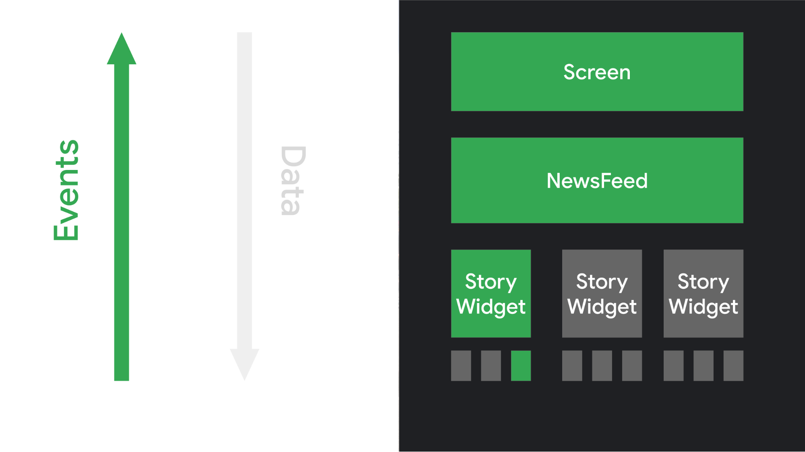

# 8주차
- Compose 이해
- 상태 관리

## 핵심 용어
- 컴포지션(Composition): 컴포저블 함수가 실행되어 UI를 구성하는 과정.
- 초기 컴포지션: 컴포저블이 처음 실행되어 컴포지션이 생성되는 시점.
- 리컴포지션(Recomposition): 데이터 변경에 따라 컴포지션이 업데이트되는 과정.

## Compose 이해
### Jetpack Compose
- Android를 위한 현대적인 선언형UI 도구 키트
- Kotlin 함수로 UI 구성
- 선언형 API를 제공

### 선언형 프로그래밍 패러다임
전통적으로 Android UI는 명령형으로 관리되며, 상태가 변경되면 UI 위젯의 상태를 직접 수정해야 한다.
그러나 Compose는 선언형 UI 모델을 사용하여 UI를 자동으로 업데이트하며, UI 갱신에 필요한 복잡성을 줄인다.

- 명령형 방식의 단점: UI를 수동으로 업데이트할 때 오류가 발생하기 쉽고, 여러 위치에서 상태를 관리하는 경우 충돌할 수 있다.
- 선언형 UI의 장점: 전체 화면을 다시 생성한 후 필요한 부분만 선택적으로 다시 그리며, 복잡성을 줄여준다.

### 간단한 구성 가능한 함수
Compose에서 UI를 빌드하는 방식은 데이터를 받아서 UI 요소를 반환하는 구성 가능한 함수를 정의하며, `@Composable` 주석을 통해 정의된다.

- `@Composable` 주석을 사용해 함수를 정의하고, UI 상태를 설명하며 반환하지 않는다.
- 멱등원이어야 하며 부작용이 없어야 한다.

```kotlin
@Composable
fun Greeting(name: String) {
    Text(text = "Hello, $name")
}
```

### 선언형 패러다임 전환
전통적으로 UI는 getter와 setter를 통해 상태를 관리하지만,
Compose에서는 UI가 스테이트리스(Stateless)하게 설계되며,
상태 변경 시 새로운 데이터를 사용하여 구성 가능한 함수가 다시 호출된다.
이때 Compose는 필요한 부분만 지능적으로 재구성한다.

| Data|Event|
|---|---|
|||
|최상위의 구성 가능한 함수에 데이터를 제공하여 다른 컴포저블을 호출 및 데이터를 아래로 전달|사용자가 UI와 상호작용하며 앱 로직이 이벤트에 응답|

### 동적 콘텐츠
Compose는 Kotlin 코드로 작성되기 때문에 동적 구성이 가능하다.
예를 들어 리스트를 받아 UI를 구성할 수 있다.

```kotlin
@Composable
fun Greeting(names: List<String>) {
    for (name in names) {
        Text("Hello $name")
    }
}
```

### 재구성
Compose는 UI 상태가 변경될 때 재구성을 통해 UI를 다시 그린다.
구성 가능한 함수는 데이터를 기반으로 다시 호출되며, 변경된 부분만 다시 렌더링된다.
예를 들어 클릭 수가 변경될 때 Compose는 텍스트만 다시 그린다.

```kotlin
@Composable
fun ClickCounter(clicks: Int, onClick: () -> Unit) {
    Button(onClick = onClick) {
        Text("I've been clicked $clicks times")
    }
}
```

### 재구성의 동작 원리
1. 재구성 Trigger: 입력값이 변경되면 구성 가능한 함수를 다시 호출한다.
2. 최적화: Compose는 변경된 함수 또는 람다만 호출하고 나머지는 건너뛴다. 이를 통해 재구성을 효율적으로 처리한다.
3. 부작용의 위험: 함수의 재구성을 건너뛸 수 있으므로, 구성 가능한 함수에서 부작용에 의존해서는 안 된다.
4. 성능 고려사항: 구성 가능한 함수가 모든 프레임에서 자주 실행되므로, 빠르고 멱등원이며 부작용이 없는 상태여야 한다. 예를 들어, 백그라운드 코루틴에서 값을 읽고 이를 매개변수로 전달해야 한다.

### 성능 최적화
Compose는 UI 트리의 모든 요소를 재구성하지 않고, 필요한 부분만 지능적으로 선택하여 재구성한다.
이를 통해 성능을 최적화하고 불필요한 연산을 줄일 수 있다.

Composable 함수의 리컴포지션이 생략될 수 있기에, 부작용(side-effect)에 의존해서는 안된다.
부작용은 앱의 나머지 부분에 표시되는 변경사항이며, 아래와 같은 예시가 있다.
- 공유 객체의 프로퍼티 쓰기
- ViewModel안의 observable 업데이트
- shared proferecnces 업데이트

부작용을 피하기 위해서는 아래와 같은 것을 준수해야한다.
- 함수는 전역 변수를 수정하거나 공유 객체에 쓰기 작업을 하지 않도록 설계되어야 한다.
- 데이터는 백그라운드 코루틴에서 처리한 후 UI에 전달하는 방식이 권장된다.

```kotlin
@Composable
fun SharedPrefsToggle(
    text: String,
    value: Boolean,
    onValueChanged: (Boolean) -> Unit
) {
    Row {
        Text(text)
        Checkbox(checked = value, onCheckedChange = onValueChanged)
    }
}
```

### 재구성에서의 주의 사항
1. 구성 가능한 함수는 순서와 관계없이 실행될 수 있다.
    Compose는 UI 요소에 우선순위를 부여하여 순서를 자유롭게 조정할 수 있다.
2. 함수는 동시에 실행될 수 있다.
   여러 함수가 동시에 실행될 수 있기 때문에, 함수 간 의존성을 줄이는 것이 중요하다.
3. 최대한의 구성 가능한 함수 및 람다를 건너뛴다.
   Compose는 UI의 일부가 잘못된 경우, 업데이트해야 할 부분만 재구성하기 위해 최선을 다한다. 
4. 낙관적이며 취소될 수 있다.
   Compose는 매개변수가 변경되기 전에 재구성을 완료할 것으로 예상한다. 재구성이 취소되면 UI 트리에서 삭제되고 부작용이 남을 수 있다.
5. 자주 실행될 수 있는 구성 가능한 함수이다.
   구성 가능한 함수는 UI 애니메이션의 모든 프레임에서 실행될 수 있으므로, 비용이 많이 드는 작업은 외부 스레드로 이동한다.


## 상태 관리
### Jetpack Compose에서 상태 관리 가이드
1. 앱의 상태란?
앱의 상태는 시간이 지남에 따라 변할 수 있는 값을 의미하며, Room 데이터베이스부터 UI의 변수까지 모든 것을 포함한다.
상태는 사용자에게 직접적으로 영향을 미치는 요소로, 네트워크 상태, 블로그 게시물, 버튼 애니메이션 등이 있다.

2. Jetpack Compose에서 상태의 중요성
Compose는 선언적 방식이므로, 컴포저블을 새 상태로 호출하는 것이 UI를 업데이트하는 유일한 방법이다.
상태가 업데이트되면 리컴포지션이 발생하고, 컴포저블은 새로운 상태에 따라 다시 그려집니다.


### 상태 저장 및 유지
컴포저블 함수에서 상태를 저장하려면 `remember` API를 사용한.
값이 컴포지션에 저장되고 리컴포지션 중에도 상태를 유지하도록 도와준다.
그러나 구성 변경이 발생할 경우 상태가 유지되지 않기에 `rememberSaveable`을 사용한다.

주의할 점으로는 변경 가능 객체(ArrayList 등)를 상태로 사용하면 리컴포지션이 트리거되지 않을 수 있다.
`State<List<T>>` 같은 불변형 데이터 구조를 사용하는 것이 좋다.

```kotlin
@Composable
fun HelloContent() {
    Column(modifier = Modifier.padding(16.dp)) {
        var name by remember { mutableStateOf("") }
        if (name.isNotEmpty()) {
            Text(text = "Hello, $name!")
        }
        OutlinedTextField(
            value = name,
            onValueChange = { name = it },
            label = { Text("Name") }
        )
    }
}
```

### 관찰 가능한 상태 유형
Jetpack Compose는 다양한 관찰 가능한 상태 유형을 지원하며, 이를 `State<T>`로 변환해 사용한다.
대표적으로 `Flow`, `LiveData`, `RxJava2/3`와의 통합을 통해 Compose에서 상태를 관리할 수 있다.

- Flow: `collectAsStateWithLifecycle()`
  수명 주기를 인식하는 방식으로 Flow의 값을 수집하여 불필요한 앱 리소스를 절약
- Flow: `collectAsState()`
  Flow에서 값을 수집하여 Compose State로 변환
  플랫폼 제약이 없는 코드에서는 Android 전용인 collectAsStateWithLifecycle 대신 collectAsState를 사용
- LiveData: `observeAsState()` 사용.
- RxJava2/3: `subscribeAsState()` 사용.

### 스테이트풀(Stateful)과 스테이트리스(Stateless)
컴포저블에서 내부 상태를 가지면 스테이트풀(Stateful) 컴포저블이 되며,
상태를 직접 관리하지 않으면 스테이트리스(Stateless) 컴포저블이 된다.

상태 호이스팅(State Hoisting)을 통해 컴포저블을 스테이트리스로 만들 수 있으며,
재사용성과 테스트 용이성을 높이는 중요한 패턴이다.

### 상태 호이스팅(State Hoisting)
컴포저블을 스테이트리스(Stateless)로 만들어 더 추론 가능하고 재사용성을 높이기 위해 상태를 컴포저블의 호출자로 옮기는 패턴이다.
상태 호이스팅 패턴은 다음과 같은 두 가지 매개변수를 사용해 구현된다.
- `value`: 표시할 값
- `onValueChange`: 값이 변경될 때 실행될 이벤트

상태 호이스팅은 아래와 같은 장점이 있다.
- 단일 정보 소스: 상태를 복제하지 않고 한 곳에서 관리
- 캡슐화: 상태 수정은 컴포저블 내부에서만 이루어짐
- 공유 가능: 여러 컴포저블에서 상태를 공유 가능
- 가로채기 가능: 상태 변경 전에 이벤트를 수정 가능
- 분리 가능: 상태가 컴포저블에서 분리 가능

```kotlin
@Composable
fun HelloContent(
    name: String,
    onNameChange: (String) -> Unit
) {
    Column(modifier = Modifier.padding(16.dp)) {
        if (name.isNotEmpty()) {
            Text(text = "Hello, $name!")
        }
        OutlinedTextField(
            value = name,
            onValueChange = onNameChange,
            label = { Text("Name") }
        )
    }
}
```
상태 호이스팅 규칙은 아래와 같은 규칙을 따른다.
1. 상태는 해당 상태를 사용하는 모든 컴포저블의 가장 낮은 공통 상위 요소로 끌어올려야 한다(읽기).
2. 상태는 최소한 상태 변경이 발생할 수 있는 가장 높은 수준으로 끌어올려야 한다(쓰기).
3. 두 상태가 동일한 이벤트에 의해 함께 변경된다면, 그 두 상태를 함께 끌어올려야 한다.

### 상태 저장 및 복원
rememberSaveable은 리컴포지션뿐만 아니라 활동 재생성 또는 프로세스 종료 후에도 상태를 유지할 수 있다.
아래는 ViewModel과 Saved instance state의 차이점이다.


### 상태 저장을 위한 옵션
1. Parcelize: 객체를 번들로 전달하기 위해 `@Parcelize`를 사용하여 객체를 `Parcelable`로 만든다.

   ```kotlin
   @Parcelize
   data class City(val name: String, val country: String) : Parcelable
   ```

2. MapSaver: `@Parcelize`가 적합하지 않을 경우 `mapSaver`를 사용해 객체를 저장할 수 있다.
   ```kotlin
   val CitySaver = mapSaver(
       save = { mapOf("Name" to it.name, "Country" to it.country) },
       restore = { City(it["Name"] as String, it["Country"] as String) }
   )
   ```

3. ListSaver: `listSaver`를 사용해 객체를 리스트로 변환해 저장할 수도 있다.
   ```kotlin
   val CitySaver = listSaver<City, Any>(
       save = { listOf(it.name, it.country) },
       restore = { City(it[0] as String, it[1] as String) }
   )
   ```

### 상태 홀더 (State Holder)
상태와 로직이 복잡해질 경우, 상태와 로직을 다른 클래스에 위임하는 것이 좋다. 이를 상태 홀더라고 한다.
상태를 더 효율적으로 관리할 수 있으며, 리컴포지션이 발생해도 상태가 유지된다.

```kotlin
@Stable
class MyAppState(private val windowSizeClass: WindowSizeClass) {
   /* 상태 관리 로직 */
}

@Composable
fun rememberMyAppState(windowSizeClass: WindowSizeClass): MyAppState {
   return remember(windowSizeClass) { MyAppState(windowSizeClass) }
}
```

### `remember` 및 키 값 관리
`remember`는 리컴포지션 중에도 상태를 유지하지만, 입력 값이 변경될 경우 캐시를 무효화하고 계산을 다시 실행할 수 있다.
키를 사용해 이 동작을 제어할 수 있다.

```kotlin
@Composable
private fun BackgroundBanner(
    @DrawableRes avatarRes: Int,
    modifier: Modifier = Modifier
) {
    val brush = remember(key1 = avatarRes) {
        ShaderBrush(
            BitmapShader(
                ImageBitmap.imageResource(res, avatarRes).asAndroidBitmap(),
                Shader.TileMode.REPEAT,
                Shader.TileMode.REPEAT
            )
        )
    }

    Box(modifier = modifier.background(brush)) { /* ... */ }
}
```